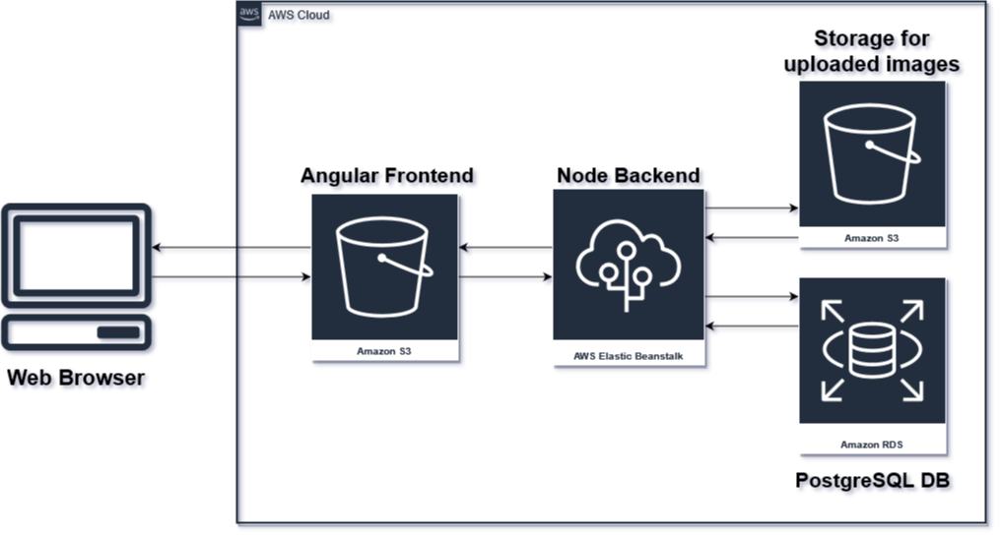
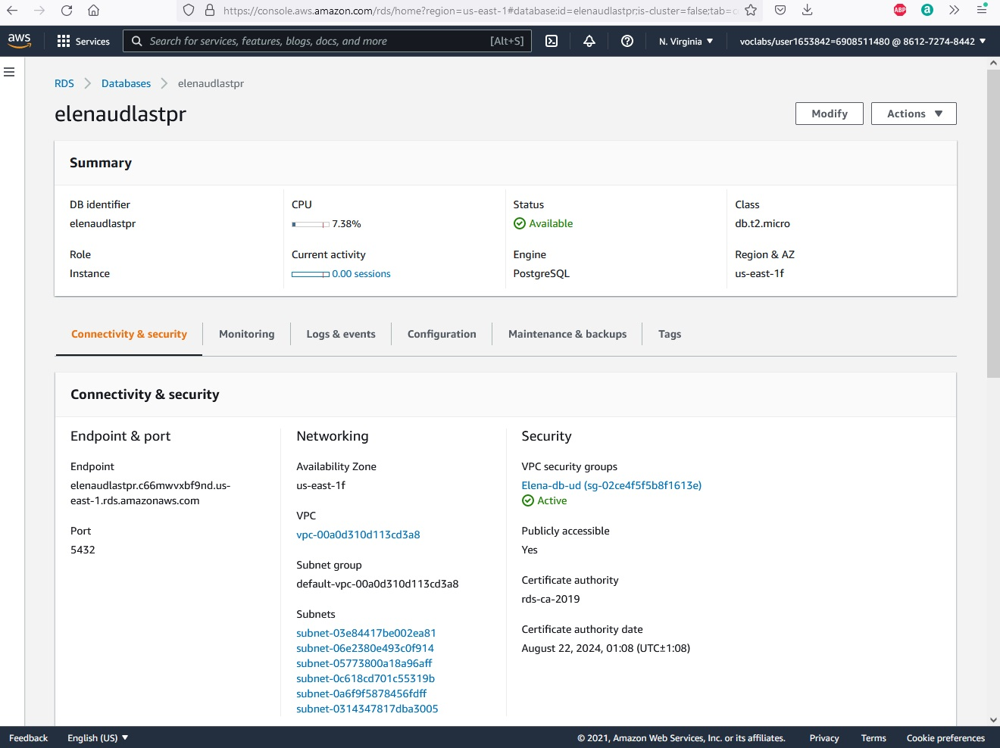
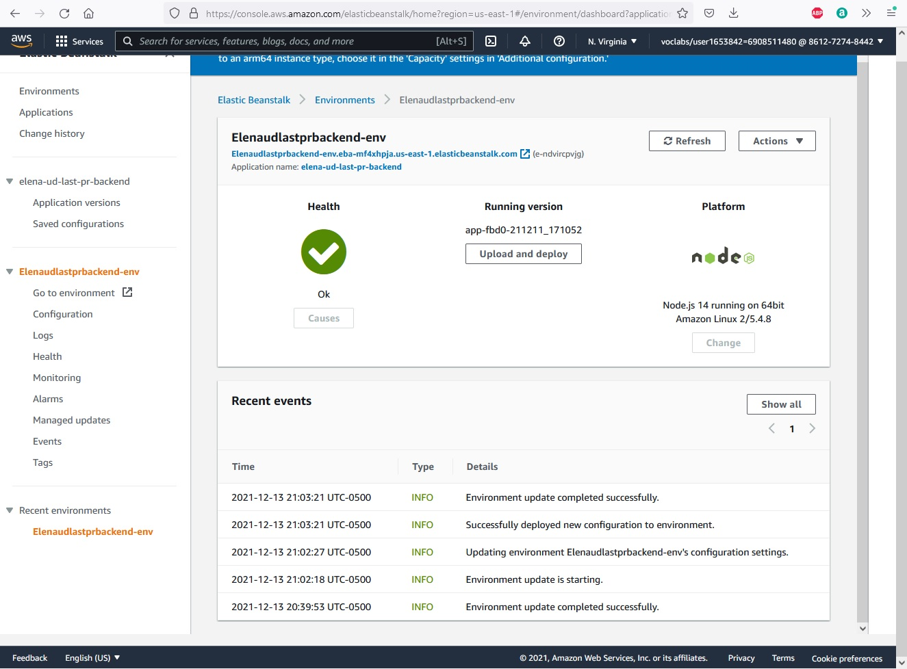
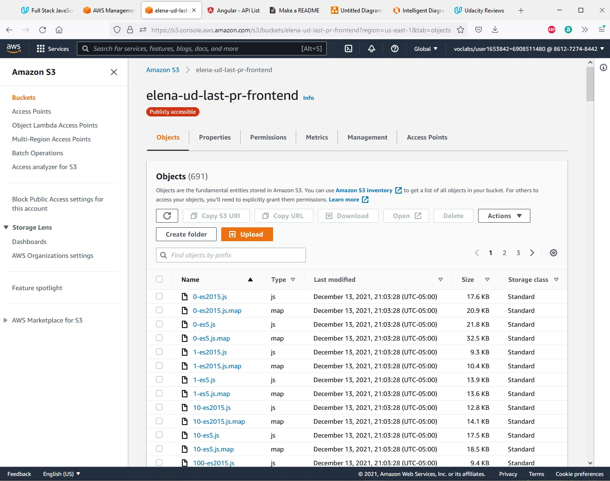
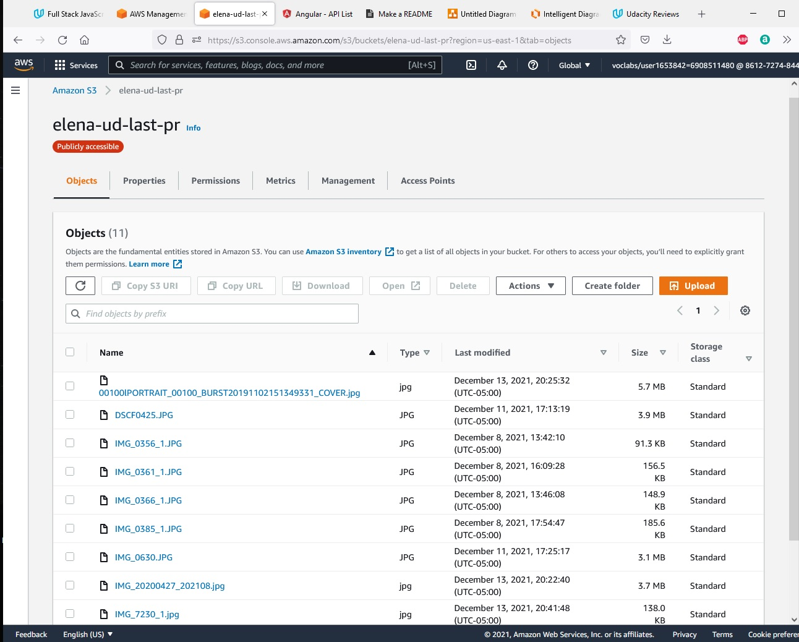
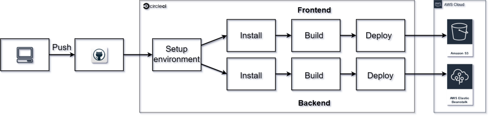
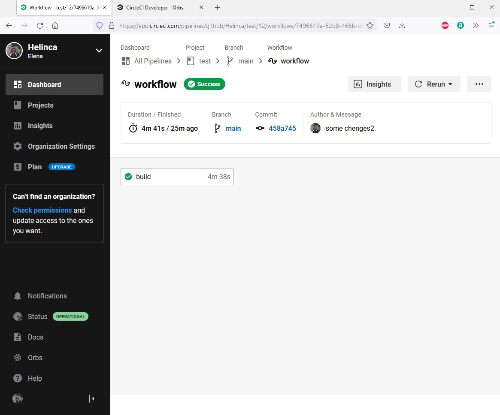
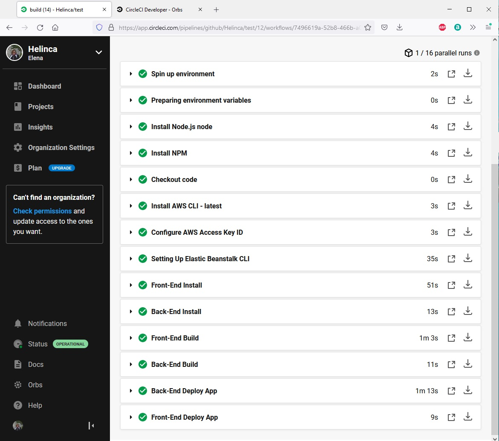

# Hosting a Full-Stack Application

This application is provided by Udacity as an alternative starter project. The udagram application is a fairly simple application that includes all the major components of a Full-Stack web application.

## Access Website

Use the following link:  [http://elena-ud-last-pr-frontend.s3-website-us-east-1.amazonaws.com](http://elena-ud-last-pr-frontend.s3-website-us-east-1.amazonaws.com) to access the website.


## Hosting

This website is hosted on AWS. Elastic Beanstalk is used for the Backend API, two S3 Buckets for the frontend and uploaded images, and a RDS database running Postgres.



>### Screenshots:
  AWS RDS - Database:
  
>
  AWS Elastic Beanstalk - API Server:
  
>
  AWS S3 - Frontend
  
>
  AWS S3 - Uploaded images
  
>


## CI / CD Pipeline

 The CircleCi is connected to the project on Github and is used to automatically deploy the website to the AWS, and it is set to automatically execute when code is pushed into the master Github project. 



>### Screenshots:
  
>  
  


### Dependencies

```
- Node v14.15.1 (LTS) or more recent. While older versions can work it is advisable to keep node to latest LTS version

- npm 6.14.8 (LTS) or more recent, Yarn can work but was not tested for this project

- AWS CLI v2, v1 can work but was not tested for this project

- A RDS database running Postgres.

- A S3 bucket for hosting uploaded pictures.

- CircleCI

```


