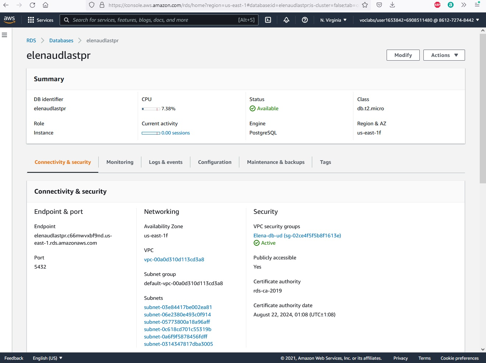
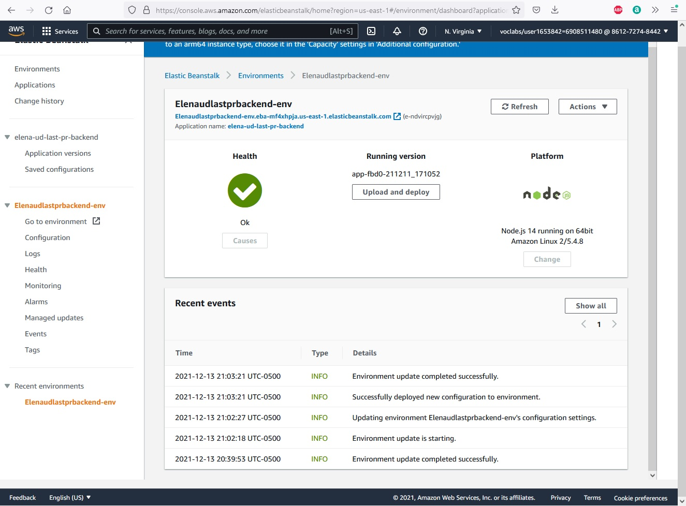
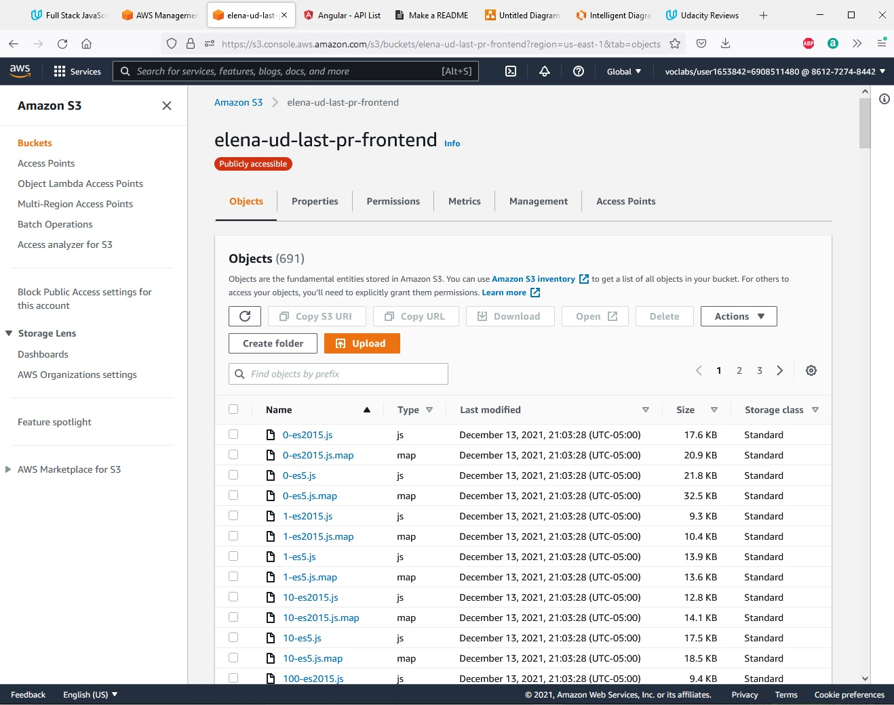
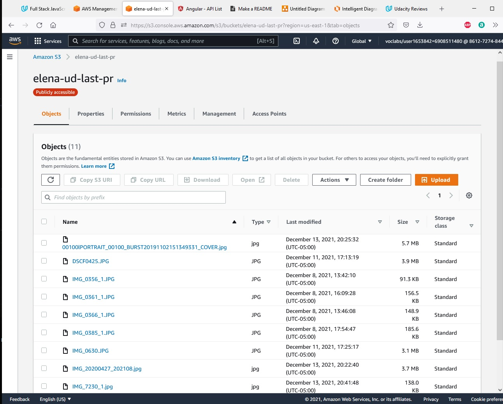

## Infrastructure Architecture

This website is hosted on AWS. Elastic Beanstalk is used for the Backend API, two S3 Buckets for the frontend and uploaded images, and a RDS database running Postgres.

>### Screenshots:
  AWS RDS - Database:
  
>
  AWS Elastic Beanstalk - API Server:
  
>
  AWS S3 - Frontend
  
>
  AWS S3 - Uploaded images
  
>

