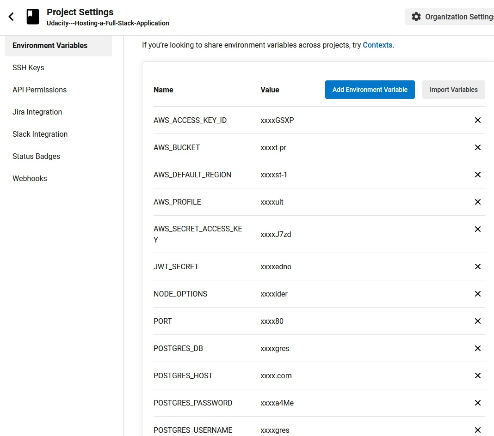

## CI / CD Pipeline

 The CircleCi is connected to the project on Github and is used to automatically deploy the website to the AWS, and it is set to automatically execute when code is pushed into the master Github project. 

>### Screenshots:
  
>  
  
>
  
